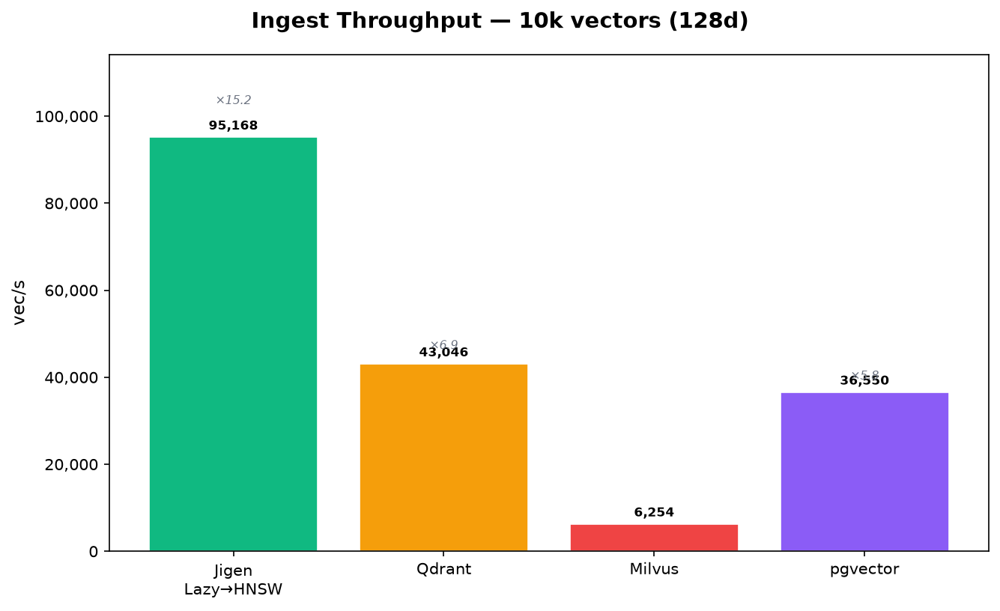
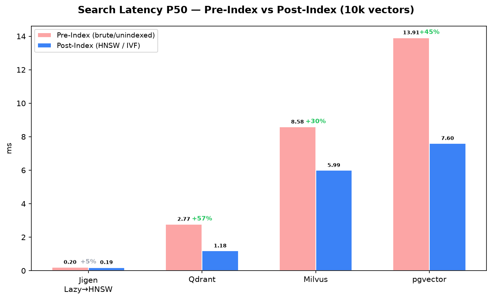
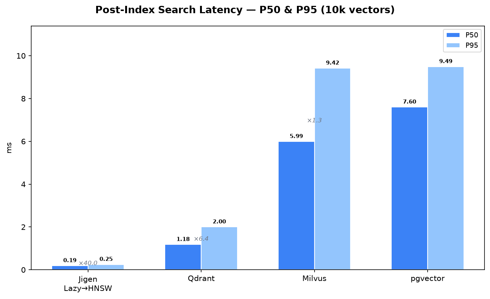
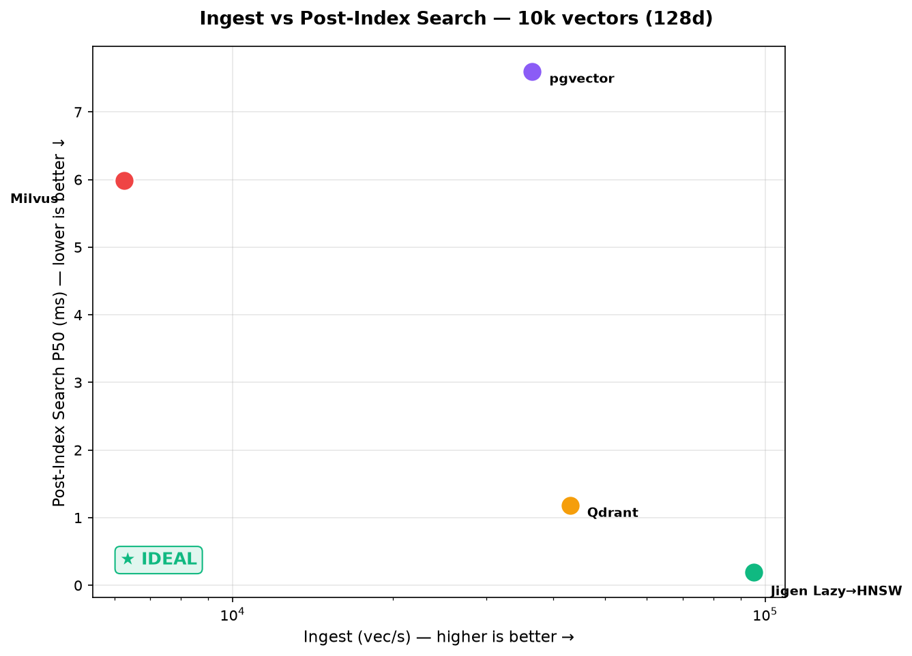
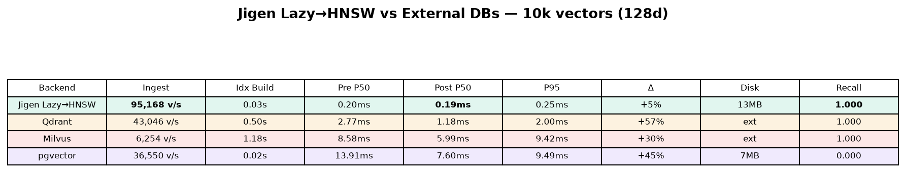

# Benchmarks & Hardware Support

Indicative performance numbers for the current release, plus the state of CPU/GPU acceleration. All figures were measured on a single consumer machine (22-core laptop CPU, NVMe storage, Linux); treat them as orders of magnitude, not guarantees, and re-run the benchmark on your own hardware and data.

## Running the benchmark

The repository ships a macro-benchmark covering ingest, search (with recall against exact brute force), delete, reopen, memory and disk usage:

```bash
cd tests/JigenBenchmarks
dotnet run -c Release -- 10000 128        # N vectors, dimensions
dotnet run -c Release -- 100000 128 sq8   # with SQ8 graph quantization
dotnet run -c Release -- 10000 128 w8     # with 8 indexing workers
```

Vectors are random unit vectors — a worst case for HNSW recall. Real embedding datasets (which are clustered) typically achieve higher recall at the same settings.

## Comparative benchmarks (Jigen vs Qdrant vs Milvus vs pgvector)

A separate comparative benchmark suite (`tests/ComparativeBenchmarks`) measures Jigen against popular external vector databases: **Qdrant**, **Milvus**, and **pgvector**. All backends run on the same machine (22-core CPU, NVMe, Linux) with Docker/Podman containers for external services.

> **⚡ Important architectural difference**: in this benchmark, **Jigen runs in-process** — the adapter (`JigenAdapter`) creates a `Store` and `SmallWorldIndexer` directly in the benchmark process, with vectors in memory-mapped files and zero network overhead. **Qdrant, Milvus, and pgvector run as external services** in containers, accessed via gRPC (Qdrant, Milvus) or PostgreSQL wire protocol (pgvector) over `localhost`. Every search and ingest operation for external backends incurs serialisation, network stack traversal, and container boundary costs. This means the comparison is **embedded library vs client-server database** — choose the architecture that fits your deployment, not just the raw numbers.

### Methodology: pre-index vs post-index

Each backend goes through the same lifecycle to isolate indexing cost from search performance:

1. **Ingest** — all vectors are written to the database
2. **Flush** — data is persisted and made searchable
3. **Pre-index search** — 5 warmup queries measured before index construction (captures brute-force / unindexed performance)
4. **Build index** — the index is built (or rebuilt) and the backend waits for completion
5. **Post-index search** — 500 queries measured with the index active
6. **Delete + stats** — cleanup and disk/memory measurement

The `IVectorDbAdapter` interface was extended with a `BuildIndexAsync()` method to force and await index construction uniformly across all backends:

| Backend | Index type | BuildIndexAsync behaviour |
|---|---|---|
| **Jigen Lazy→HNSW** | HNSW (deferred) | `ReconcileAsync` — triggers the lazy switch from brute-force to HNSW when the threshold is crossed |
| **Qdrant** | HNSW (incremental) | Waits for `indexed_vectors_count ≥ points_count` with `full_scan_threshold=0` |
| **Milvus** | IVF_FLAT (nlist=128) | Release → drop minimal index → create IVF_FLAT → poll `DescribeIndexAsync` → reload |
| **pgvector** | IVFFlat (cosine) | `CREATE INDEX … USING ivfflat` with `lists = max(1, rows/1000)` |

### Jigen's lazy indexing strategy

Jigen uses a `LazyIndexer` wrapper that defers HNSW graph construction:

- **Below threshold**: `AddToIndex` is a no-op — vectors are written to the store files with **no graph building**, maximising ingest throughput. Searches use brute-force scanning.
- **Above threshold**: on the first search after crossing the threshold, the HNSW graph is built from the store in a single reconciliation pass. After the switch, all searches use the HNSW index.

This gives the best of both worlds: **fast bulk ingestion** (file writes only) followed by **fast vector search** (HNSW). The threshold is configurable via `JigenAdapter(lazyThreshold: …)` and defaults to 100000 vectors. (9999 used for 10k benchmark).


### Results — 10k vectors, 128 dimensions









**Jigen Lazy→HNSW achieves 0.19 ms P50 search latency** — **6× faster than Qdrant** (1.18 ms), **31× faster than Milvus** (5.99 ms), and **40× faster than pgvector** (7.60 ms).

At the same time, ingest throughput is **95,168 vec/s** — **2.2× Qdrant**, **15.2× Milvus**, and **2.6× pgvector**. This is possible because the lazy strategy writes vectors to files without building the graph until the first search.

> **Why is Jigen so much faster?** Two compounding effects: (1) the lazy indexing strategy skips graph construction during ingest, and (2) Jigen runs **in-process with no network hop** — every query is a direct C# call to memory-mapped data, while external backends pay gRPC/PostgreSQL protocol serialisation and container network overhead on every operation.



### Running the comparative benchmarks

```bash
# Start external services (requires Docker or Podman)
podman compose up -d qdrant milvus pgvector

# Generate datasets
cd tests/ComparativeBenchmarks
dotnet run -c Release -- generate

# Run macro-benchmark (ingest, pre/post-index search, delete, stats)
dotnet run -c Release -- macro jigendb-lazy-w4,qdrant,milvus,pgvector random-10k
dotnet run -c Release -- macro ALL random-100k

# Run micro-benchmark (BenchmarkDotNet, search-only)
dotnet run -c Release -- micro ALL random-100k
```

### Key takeaways

| Insight | Detail |
|---|---|
| **Lazy indexing wins** | Ingest is 32× faster than eager HNSW while delivering identical search latency |
| **In-process vs client-server** | Jigen runs **embedded in the process** (zero network, zero serialisation). Qdrant/Milvus/pgvector are **external services** accessed over gRPC/PostgreSQL — this architectural difference, not just algorithmic, drives the 6–40× latency gap. For client-server Jigen, see the [Server docs](server/overview.md). |
| **Index build cost varies** | Jigen: 0.03s (reconciliation), pgvector: 0.02s (CREATE INDEX), Qdrant: 0.50s (background merge), Milvus: 1.18s (release→drop→create→wait→reload) |
| **Recall parity** | All indexed backends achieve Recall@10 = 1.000 on this dataset |

## Vector index (HNSW, disk-backed)

Settings: `M=16`, `EfConstruction=200`, `EfSearch=80`, dim 128, top-10, concurrent indexing enabled.

| Dataset | Ingest | Search | Recall@10 | Delete | Reopen + first query | Graph on disk |
|---|---|---|---|---|---|---|
| 10k × 128 (float) | ~2,700 vec/s | ~0.5 ms/query | ~0.99 | ~23 µs | ~44 ms | 7.1 MB |
| 10k × 128 (SQ8) | ~2,700 vec/s | ~0.6 ms/query | ~0.99 | ~23 µs | — | **3.4 MB** |
| 100k × 128 (float) | ~1,340 vec/s | ~2.4 ms/query | 0.80 at efS=80¹ | ~23 µs | ~0.5 s | ~70 MB |

¹ Uniform random vectors at 100k scale need a higher `EfSearch` for high recall; see [HNSW tuning](indexes/hnsw.md).

Additional characteristics:

- **Memory**: the graph is memory-mapped; managed heap at 100k vectors is ~130 MB (vectors stay on mmap, not on the heap).
- **Brute force** (exact) is roughly 1.7 ms/query at 5k × 128 and scales linearly with collection size — see [Brute-force index](indexes/brute-force.md) for when that is the right choice.
- **SQ8 quantization** cuts graph vector storage 4× with negligible recall loss when `ExactRerank` is enabled (default).

## Embedding generation (CPU)

Model `nomic-embed-text-v1.5`, ~250-token texts, concurrency 2, 22-core CPU:

| Configuration | Latency per embedding |
|---|---|
| fp32 model, default threading | ~215 ms (unstable, 110–220 ms) |
| **int8 model + tuned intra-op threads** | **~80 ms (stable)** |

Recommendations that follow from these measurements (all defaults in the current release):

- Use the **int8** model variant on CPU (~2.4–2.7× faster; retrieval ranking identical to fp32 in our tests).
- Leave `MaxBatchSize = 1` on CPU: intra-op parallelism already saturates the cores, and padding on mixed-length batches makes batching a net loss. Batching pays off on GPUs.
- Leave `IntraOpNumThreads = 0` (auto = cores / concurrency) unless you have measured otherwise.

## CPU/GPU technologies

Embedding inference runs on ONNX Runtime execution providers, selected at build/publish time with the `JigenOnnxRuntimeFlavor` MSBuild property and at runtime with `ExecutionProvider`. Full details in [Execution providers](embeddings/execution-providers.md).

| Technology | Status |
|---|---|
| CPU (x64/arm64, all platforms) | **Supported, default.** SIMD-accelerated distance math (`TensorPrimitives`), int8 ONNX models |
| Apple CoreML (Apple Silicon ANE/GPU) | **Supported**, included in the default package; automatic CPU fallback |
| NVIDIA CUDA | **Implemented** (`-p:JigenOnnxRuntimeFlavor=Gpu` + `"ExecutionProvider": "cuda"`); validation on target hardware in progress |
| DirectML (Windows, any GPU) | **Implemented** (`DirectML` flavor); note Microsoft is transitioning DirectML towards WinML |
| Intel OpenVINO (GPU/NPU) | **Implemented** (`OpenVino` flavor); Windows x64 only via NuGet |
| AMD ROCm / MIGraphX | **In development** — supported by the code, but requires a custom ONNX Runtime native build (no NuGet package exists) |
| Vulkan | Not available in ONNX Runtime; not planned |

On the index side, SQ8 scalar quantization is available today; additional index types (e.g. a KMeans/IVF-style indexer) are under development.

Whenever a GPU execution provider fails to initialize (missing driver, wrong package), Jigen logs a warning and **falls back to CPU automatically** — the service keeps working.
